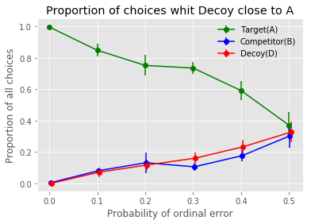
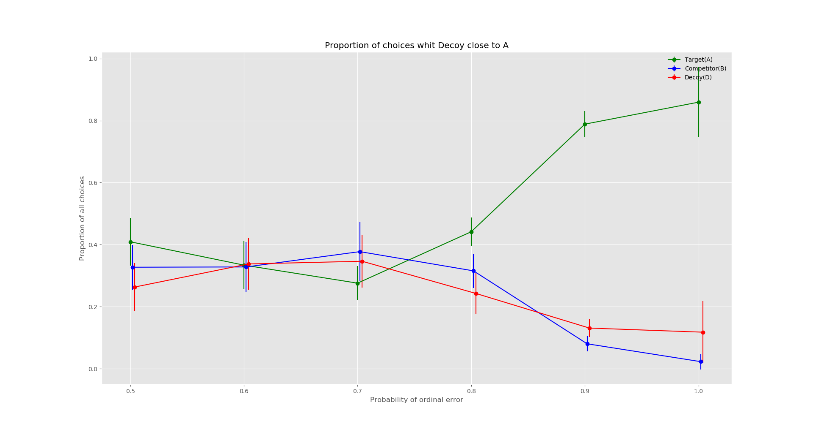
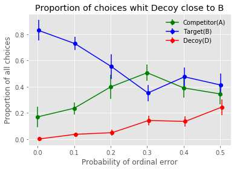
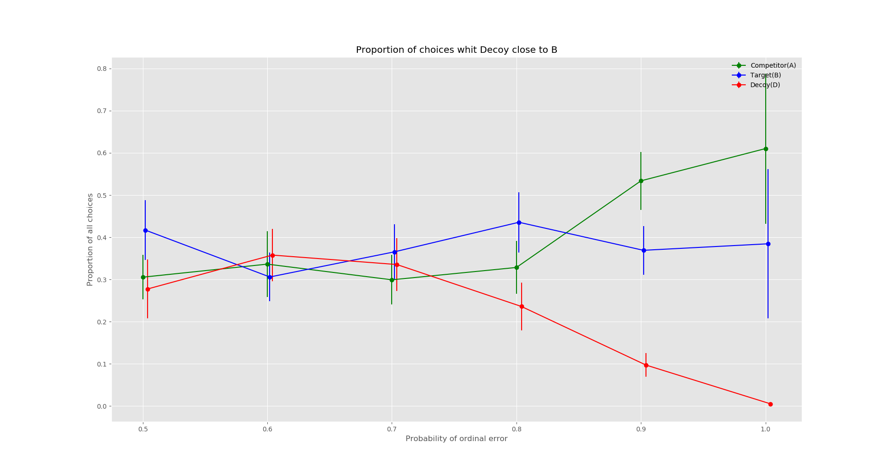

# CogSciLab
Explore human decision making with Artificial Intelligence approach

## Introduction

There is a very interesting phenomenon that people's preference changed by adding a third alternative. It has been a evidence to against the opinion that hunman decision making is irrational. However, recent study .[1], .[2] show that hunman decision making is optimal. In this project, we will try to underly information processing mechanisms in the human decision making task and find the way to help people make better dicisions.

## Result

Result of the proportion of choices during testing with the probability of ordinal error from 0.0 to 1.0

## Reference

.[1] Why Contextual Preference Reversals Maximize Expected Value (http://www-personal.umich.edu/~rickl/pubs/howes-et-al-2016-psyrev.pdf)

.[2] The Effect of Expected Value on Attraction Effect Preference Reversals (http://onlinelibrary.wiley.com/doi/10.1002/bdm.2001/full)
