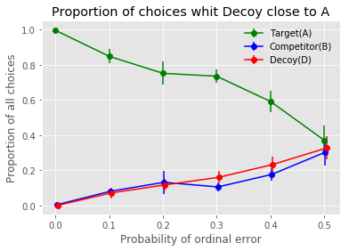
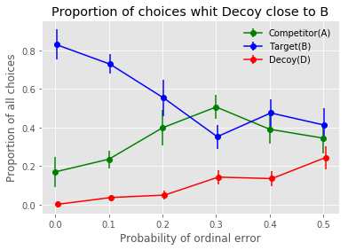
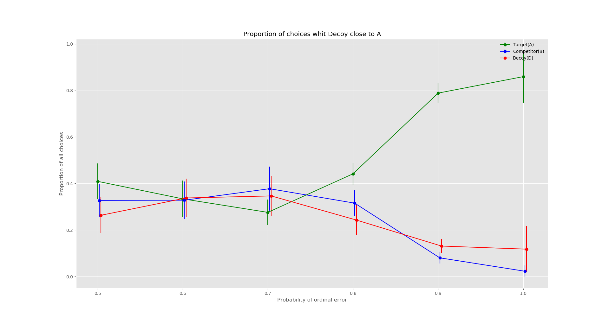
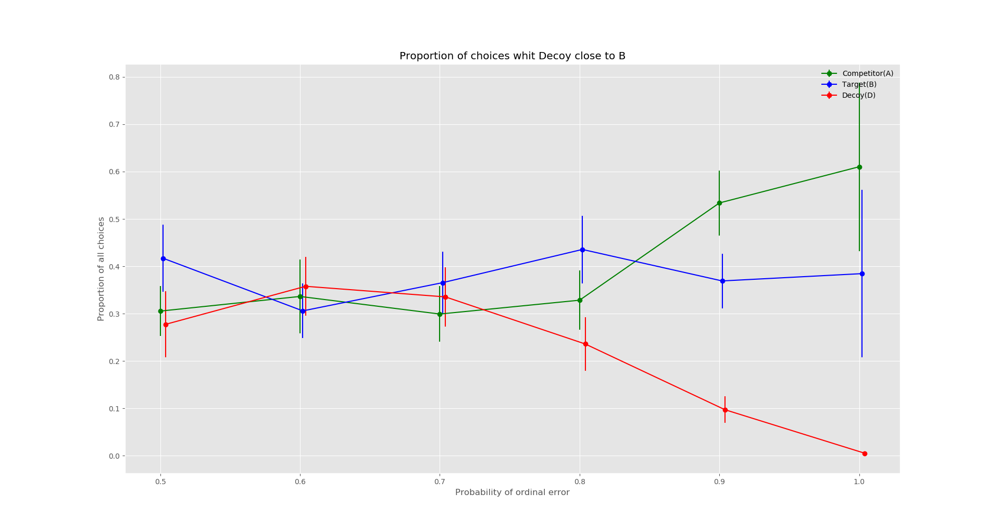

# CogSciLab
Explore human decision making with Artificial Intelligence approach

[Report](https://www.overleaf.com/16918333ygqwsgsnddfm)
## Introduction

There is a very interesting phenomenon that people's preference changed by adding a third alternative. It has been a evidence to against the opinion that human decision making is irrational. However, recent study [1], [2] show that human decision making is optimal. In this project, we will try to underlie information processing mechanisms in the human decision making task and find the way to help people make better decisions.

## Method

1. Value-based reinforcement learning approach
- Q-learning
- Linear value function appromaxition
- DQN (In progress)

2. Policy-based approach
- REINFORCE (Monte Carlo Policy Gradient)
- Actor-Critic (AC)

## Result
The distribution of probability is the distribution with parameters (a = 1, b = 1) and the distribution of value is the t distribution with parameters (location = 19.60, scale = 8.08, and df = 100).

Result of the proportion of choices during testing with the probability of ordinal error from 0.0 to 1.0

## Reference

.[1] [Why Contextual Preference Reversals Maximize Expected Value](http://www-personal.umich.edu/~rickl/pubs/howes-et-al-2016-psyrev.pdf)

.[2] [The Effect of Expected Value on Attraction Effect Preference Reversals](http://onlinelibrary.wiley.com/doi/10.1002/bdm.2001/full)

Projects

 [dennybritz/reinforcement-learning](https://github.com/dennybritz/reinforcement-learning)
